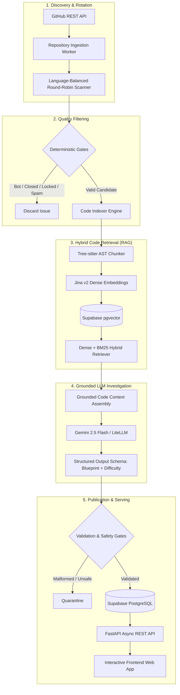
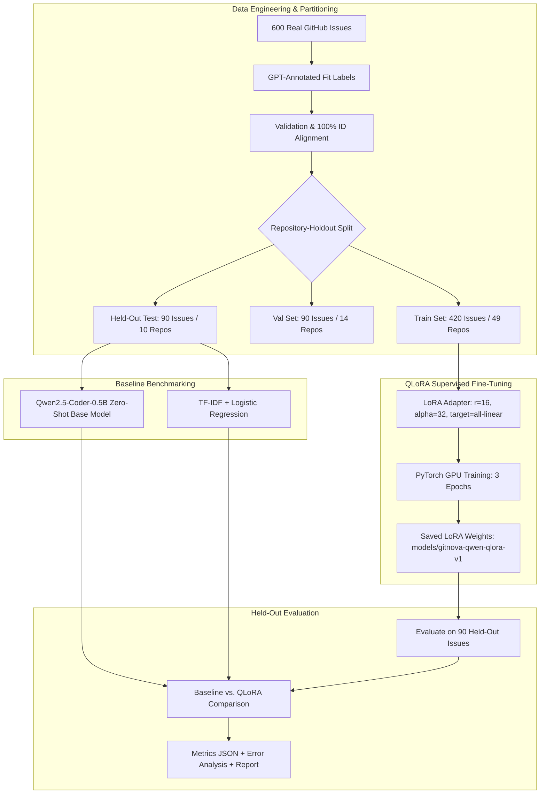
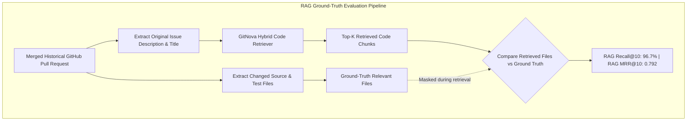

# GitNova 🚀

> **Production-Grade Open Source Contribution Discovery, Code Intelligence, and Machine Learning Evaluation Engine**

GitNova is an autonomous intelligence platform that helps software engineers discover, evaluate, and resolve high-signal GitHub issues across the open-source software ecosystem.

Rather than acting as a naive "good first issue" search tool or scraping uncurated issue lists, GitNova solves a fundamental information retrieval and decision-making challenge:

```
      Millions of Open GitHub Issues
                   ↓
   [ Discovery & Language Rotation ]
                   ↓
      [ Deterministic Filtering ]
                   ↓
 [ AST-Aware Hybrid Code Retrieval (RAG) ]
                   ↓
   [ Repository-Grounded LLM Mentor ]
                   ↓
  [ Multi-Tier Quality & Safety Gates ]
                   ↓
  Curated Actionable Contribution Feed
```

---

## ⚡ Key Capabilities

- **Automated Issue Discovery & Rotation**: Cycles deterministically through active open-source repositories across 20+ programming ecosystems (Python, TypeScript, Go, Rust, Java, C++, Ruby, etc.) with zero repository starvation.
- **Deterministic Quality Gates**: Pre-filters noise, bots, locking issues, spam, and non-actionable questions before invoking downstream models.
- **AST & Tree-Sitter Hybrid Code Retrieval (RAG)**: Chunks codebases via syntax-aware AST parsing and retrieves relevant source and test files using dense vector embeddings + BM25 keyword search.
- **Grounded LLM Investigation**: Employs Gemini / LiteLLM with file-level grounding, generating reproduction steps, root cause analyses, and test blueprints.
- **Publication & Contract Validation**: Enforces structured JSON schemas and strict safety filters before storing opportunities in Supabase PostgreSQL + pgvector.
- **Offline QLoRA Candidate-Fit Classifier (ML Experiment)**: A fine-tuned `Qwen2.5-Coder-0.5B-Instruct` model trained with LoRA on a 600-issue leakage-safe dataset to classify candidate investigation viability.
- **Rolling RAG Benchmark**: Evaluates retrieval accuracy against ground-truth changed files from historical merged pull requests.

---

## 🏗️ Production vs. Experimental Architecture

GitNova strictly isolates active production pipelines from offline machine learning research.

| Component / Subsystem | Production Status | Experimental / Research Status | Primary Responsibility |
| :--- | :--- | :--- | :--- |
| **Repository Discovery** | ✅ **Active** | — | Language-balanced repository round-robin polling |
| **Deterministic Gates** | ✅ **Active** | — | Zero-cost rule-based spam/lock filtering |
| **Hybrid Code Retrieval (RAG)** | ✅ **Active** | ✅ **Evaluated** | Tree-sitter chunking + Jina v2 embeddings + dense retrieval |
| **Gemini LLM Investigation** | ✅ **Active** | — | Structured blueprint & difficulty tier classification |
| **Safety & Validation Gates** | ✅ **Active** | — | Enforces schema validation before DB publication |
| **QLoRA Candidate Classifier** | ❌ *Offline Only* | ✅ **Completed** | Parameter-efficient fine-tuning for candidate filtering |
| **Rolling RAG Evaluation** | ✅ **Active** (Scheduled) | — | Evaluates retrieval Recall@K against merged PR changes |

---

## 🔄 Production Intelligence Pipeline

The live production system executes autonomously via background workers and serves pre-computed intelligence via a FastAPI backend and interactive frontend.



---

## 🔬 Offline ML Experiment: QLoRA Candidate-Fit Classification

During candidate discovery, deciding whether an issue justifies expensive repository-grounded RAG retrieval and LLM investigation is critical for cost and latency optimization. We built a complete, leakage-safe supervised fine-tuning pipeline.



### 1. Dataset Construction & Leakage Prevention

- **Total Dataset Size**: 600 real GitHub issues (`is_pull_request: false`) across **73 repositories** and **20 programming languages**.
- **Fit Classes**: `HIGH_FIT` ($45.3\%$), `MEDIUM_FIT` ($41.5\%$), `LOW_FIT` ($13.2\%$).
- **Repository-Holdout Splitting**:
  - **Train Set**: 420 issues across 49 repositories ($70.0\%$).
  - **Validation Set**: 90 issues across 14 repositories ($15.0\%$).
  - **Held-Out Test Set**: 90 issues across 10 unseen repositories ($15.0\%$).
- **Leakage Status**: **`PASS`** (Zero repository intersection: $\text{Train} \cap \text{Val} = \emptyset$, $\text{Train} \cap \text{Test} = \emptyset$, $\text{Val} \cap \text{Test} = \emptyset$).

> **Why Repository-Holdout Matters**: Issues originating from the same repository share common maintainers, issue templates, coding styles, and vocabulary. A naive random row split causes high repository leakage, giving artificially inflated evaluation scores. Isolating entire repositories into the held-out test partition evaluates true generalization to unseen software projects.

---

### 2. Fine-Tuning Configuration

- **Base Model**: `Qwen/Qwen2.5-Coder-0.5B-Instruct` (0.5B parameters, instruction-tuned coder).
- **Adaptation Method**: Low-Rank Adaptation (LoRA / QLoRA) via `peft`.
- **Rank ($r$) & Alpha ($\alpha$)**: $r = 16$, $\alpha = 32$, Dropout = $0.05$.
- **Target Modules**: All linear attention and MLP projections (`q_proj`, `v_proj`, `k_proj`, `o_proj`, `gate_proj`, `up_proj`, `down_proj`).
- **Trainable Parameters**: 8,798,208 ($1.75\%$ of total model parameters).
- **Loss Masking**: Token-level label masking (`-100` on prompt tokens), computing cross-entropy loss exclusively on the single-token classification target.
- **Optimization**: AdamW (`lr = 2e-4`, linear warmup schedule, weight decay $0.01$, gradient clipping $1.0$).

---

### 3. Empirical Results & Benchmark Comparison

Evaluated on the exact same **90 held-out test issues across 10 unseen repositories**:

| Model Architecture | Accuracy | Macro Precision | Macro Recall | Macro F1 | HIGH_FIT F1 | MEDIUM_FIT F1 | LOW_FIT F1 |
| :--- | :--- | :--- | :--- | :--- | :--- | :--- | :--- |
| **Base Qwen2.5-Coder-0.5B (Zero-Shot)** | 0.2778 | 0.2246 | 0.3425 | **0.2096** | 0.0000 | 0.4182 | 0.2105 |
| **TF-IDF + Logistic Regression** | 0.6000 | 0.5880 | 0.4905 | **0.4472** | 0.7387 | 0.4324 | 0.1705 |
| **Fine-Tuned QLoRA Adapter (Ours)** | **0.8222** | **0.8208** | **0.7852** | **0.7941** | **0.8889** | **0.6364** | **0.8571** |
| **Delta ($\Delta$ vs Base Model)** | **+0.5444** | **+0.5962** | **+0.4427** | **+0.5845** | **+0.8889** | **+0.2182** | **+0.6466** |

```
Confusion Matrix (Held-Out Test Set, n=90):
                Predicted HIGH_FIT   Predicted MEDIUM_FIT   Predicted LOW_FIT
True HIGH_FIT            48                     2                    0
True MEDIUM_FIT          10                    14                    2
True LOW_FIT              0                     2                   12
```

---

### 4. Error Analysis & Failure Modes

Analysis of the 16 misclassifications ($17.8\%$ error rate) on the held-out test partition:
1. **`MEDIUM_FIT → HIGH_FIT` (10 cases, $62.5\%$ of errors)**: Moderate-scope issues with slight ambiguity in reproduction steps that the model prioritized aggressively.
2. **`HIGH_FIT → MEDIUM_FIT` (2 cases)**: Complex architectural bug reports classified conservatively.
3. **`LOW_FIT → MEDIUM_FIT` (2 cases)**: Sparse issues where the model gave benefit of the doubt.
4. **`MEDIUM_FIT → LOW_FIT` (2 cases)**.
5. **`LOW_FIT → HIGH_FIT` (0 cases on this test partition)**: The model successfully prevented non-actionable or conversational rants from falsely triggering expensive downstream stages.

---

## 🎯 Code Retrieval Evaluation (RAG Ground-Truth Benchmark)

Separate from candidate-fit classification, GitNova independently evaluates its **hybrid repository code retriever**.



### Retrieval Benchmark Methodology
- **Ground Truth**: Extracted from merged GitHub pull requests across multi-language repositories.
- **Evaluation Independence**: The merged PR file diff is strictly masked from the retrieval query; the retriever only receives the raw issue title and description.
- **Verified Benchmark Metrics**:
  - **RAG Recall@10**: **`96.7%`** (Proportion of actual PR fix files retrieved in top 10 chunks).
  - **RAG MRR@10**: **`0.792`** (Mean Reciprocal Rank of first relevant source file).

> **Methodology Distinction**:
> - **QLoRA Evaluates**: Candidate issue investigation viability (`HIGH`, `MEDIUM`, `LOW`).
> - **RAG Evaluates**: Grounded source-code file localization accuracy.
> - These are independent metrics measuring separate stages of the pipeline.

---

## 🧠 Engineering Decisions & Interview Defensibility

### 1. Why QLoRA instead of Full Fine-Tuning?
Training LoRA rank-16 adapters updates only $1.75\%$ of weights ($8.79\text{M}$ parameters), preventing catastrophic forgetting of base coding knowledge while running efficiently on consumer hardware (e.g., 4GB VRAM GPU) and producing a lightweight $33.6\text{MB}$ adapter artifact.

### 2. Why Repository-Holdout Splits instead of Random K-Fold?
Random row splitting causes data leakage because models memorize repository-specific terminology and file structures. Grouping by repository guarantees that validation and test scores reflect genuine generalization to new open-source projects.

### 3. Why Hybrid Code Retrieval (Dense + BM25)?
Pure vector search excels at high-level semantic intent but struggles with exact programming tokens (e.g., function names like `get_rotated_repositories` or error strings like `ECONNREFUSED`). BM25 handles exact keyword matching while dense embeddings capture conceptual relevance.

### 4. Why AST & Tree-Sitter Chunking?
Fixed-size token chunking splits functions, classes, and control flow arbitrarily across boundaries. Tree-sitter parses the abstract syntax tree to chunk code at logical function/class boundaries with contextual path metadata.

### 5. Why use Merged Pull Request Diff as RAG Ground Truth?
The actual files changed in a merged fix PR represent the objective empirical ground truth of what code needed to be modified to resolve the issue.

### 6. Why use Macro F1 as the Primary Metric?
With class imbalance ($45.3\%$ High, $41.5\%$ Medium, $13.2\%$ Low), raw accuracy can be inflated by predicting majority classes. Macro F1 weights all three classes equally, ensuring low-fit rejection is penalized equally with high-fit detection.

### 7. Why Keep Fine-Tuning Isolated from Production?
Production systems require deterministic safety, zero-cost rollback, and predictable SLAs. The fine-tuned model is evaluated offline and maintained as an optional shadow-mode pre-filter.

---

## 📁 Repository Structure

```
gitnova/
├── backend/
│   ├── app/                                 # Production Intelligence Engine
│   │   ├── api/                             # FastAPI REST API endpoints
│   │   ├── core/                            # Config, logging, and database clients
│   │   ├── discovery/                       # Ingestion & repo diversity rotation
│   │   ├── gates/                           # Deterministic pre-filters
│   │   ├── gemini/                          # LLM investigation & schema enforcement
│   │   ├── pipeline/                        # End-to-end sync & rolling evaluation
│   │   ├── rag/                             # Tree-sitter chunking & hybrid retrieval
│   │   └── schemas/                         # Pydantic v2 data models
│   ├── data/
│   │   └── dataset_collection/final_v1/     # Supervised ML Experiment Artifacts
│   │       ├── train.jsonl                  # 420 Training issues (49 repos)
│   │       ├── validation.jsonl             # 90 Validation issues (14 repos)
│   │       ├── test.jsonl                   # 90 Held-out test issues (10 repos)
│   │       ├── joined_supervised_dataset.jsonl
│   │       ├── validation_report.json       # 100% ID alignment validation report
│   │       ├── experiment_results.json      # Full metrics & confusion matrices
│   │       ├── experiment_report.md         # Detailed markdown ML report
│   │       ├── error_analysis.jsonl         # Prediction breakdown & error modes
│   │       └── models/gitnova-qwen-qlora-v1/# LoRA Adapter Config & Metadata
│   ├── scripts/                             # Reproducible Pipeline & Evaluation CLIs
│   │   ├── run_gitnova_qlora_experiment.py  # Master end-to-end ML pipeline
│   │   └── evaluate_gitnova_model.py        # Standalone evaluation CLI
│   └── tests/                               # 290+ Unit & Integration Test Suite
├── frontend/                                # Production UI Web Application
├── docker-compose.yml                       # Containerized orchestration
└── README.md                                # Platform documentation
```

---

## 🚀 Reproducing the Experiments

### 1. Environment Setup
```bash
# Clone repository
git clone https://github.com/sriharizz/gitnova.git
cd gitnova

# Install dependencies with CUDA PyTorch
pip install -r backend/requirements.txt
pip install torch torchvision --index-url https://download.pytorch.org/whl/cu121
pip install peft transformers datasets scikit-learn accelerate
```

### 2. Run the Full QLoRA Fine-Tuning & Evaluation Pipeline
```bash
python backend/scripts/run_gitnova_qlora_experiment.py \
    --base-model Qwen/Qwen2.5-Coder-0.5B-Instruct \
    --epochs 3 \
    --batch-size 1
```

### 3. Evaluate the Fine-Tuned Adapter on Held-Out Test Set
```bash
python backend/scripts/evaluate_gitnova_model.py \
    --base-model Qwen/Qwen2.5-Coder-0.5B-Instruct \
    --model-path backend/data/dataset_collection/final_v1/models/gitnova-qwen-qlora-v1 \
    --test-file backend/data/dataset_collection/final_v1/test.jsonl \
    --is-adapter
```

---

## ⚠️ Limitations & Boundary Conditions

1. **Dataset Scope**: The current supervised experiment is evaluated on 600 issues across 73 repositories and 20 languages. While diverse, specialized domain-specific repositories (e.g., embedded systems or hardware drivers) may require additional domain adaptation.
2. **Annotation Labels**: Ground-truth fit labels were generated via structured GPT annotations; human expert verification on larger enterprise datasets is planned for future iterations.
3. **Hardware Constraints**: The QLoRA experiment was tuned on consumer GPU hardware (4GB VRAM). Larger base models (e.g., 7B or 14B) could yield higher precision on subtle multi-file bugs.
4. **Offline Isolation**: The QLoRA candidate classifier is currently maintained strictly as an offline research artifact and does not alter production traffic.

---

## 📄 License & Contact

GitNova is released under the **MIT License**. Created by Srihari ([@sriharizz](https://github.com/sriharizz)).
