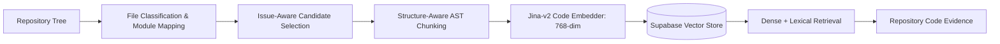
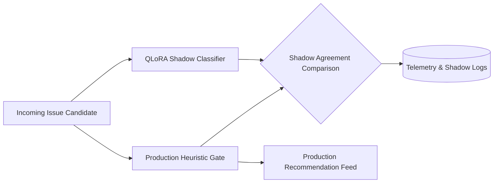

# GitNova

> **AI-Powered Open-Source Contribution Discovery, Grounded Code Intelligence, and Contribution Guidance Engine**

GitNova is a developer intelligence platform that helps software engineers discover actionable open-source contribution opportunities and guides them through the complete contribution lifecycle—from issue understanding and repository exploration to local reproduction, implementation planning, and pull request preparation.

```
Developer Preferences ──► Contribution Feed ──► Issue Understanding ──► Repository Code Context ──► Local Investigation ──► Fix Plan ──► Test Guidance ──► PR Preparation
```

---

## The Problem

Finding a suitable open-source issue on GitHub is difficult for contributors:

1. **Information Overload**: GitHub contains millions of open issues, but most "good first issue" labels are stale, already claimed, triaged as non-reproducible, or unmaintained.
2. **Context Barrier**: Navigating a large multi-package codebase requires hours of manual code exploration before a contributor can locate the bug origin or identify target functions.
3. **Hallucination & Unsupported Advice**: Naive LLM assistants often propose fictional file paths, hallucinated function signatures, or generic architectural advice disconnected from the actual repository tree.

GitNova solves this by combining automated GitHub discovery, deterministic quality gates, selective structural repository indexing, dense code retrieval (RAG), and AST-grounded LLM investigation into a guided 10-stage contributor workflow.

---

## 1. System Architecture

```mermaid
flowchart LR
    subgraph Discovery ["1. Ingestion & Filtering"]
        GH[GitHub API] --> Ingest[Repo Ingestor]
        Ingest --> Qual[Noise & Availability Gates]
    end

    subgraph RAGPipeline ["2. Selective RAG & Indexing"]
        Qual --> RepoMap[Repository Map]
        RepoMap --> Cand[Issue-Aware Candidate Selection]
        Cand --> AST[AST & Structured Chunking]
        AST --> Embed[Jina-v2 Embeddings]
        Embed --> VectorStore[(Supabase pgvector)]
    end

    subgraph Reasoning ["3. Grounded Reasoning"]
        VectorStore --> HybridRet[Dense + Lexical Retrieval]
        IssueQuery[Issue Query] --> HybridRet
        HybridRet --> GroundedEv[Repository Evidence]
        GroundedEv --> LLM[LLM Reasoning: Gemini 2.5 Flash]
        LLM --> Verify[Source & AST Verification Gate]
    end

    subgraph Delivery ["4. Feed & Journey"]
        Verify --> Ranking[Scoring & Repo Diversity]
        Ranking --> Feed[Recommendation Feed]
        Feed --> Journey[10-Stage Contributor Journey]
    end
```



---

## 2. Selective RAG & Indexing Pipeline

Indiscriminately embedding an entire repository is expensive, introduces vector search noise, and starves critical sub-packages under a fixed token budget. GitNova uses a two-tier selective indexing pipeline that narrows the search space before embedding while preserving structural module coverage:



> **Why Selective Indexing Exists**: In large multi-package repositories, flat file budgets can easily miss critical nested modules. The system first narrows the search space using metadata analysis and path overlap, enforces baseline module representation across distinct packages, and then embeds higher-value code units.

---

## 3. Controlled RAG Retrieval Evaluation

To measure retrieval behavior empirically, GitNova was evaluated against a controlled benchmark of real GitHub issues with ground-truth file locations derived from merged pull request diffs.

### Controlled Retrieval Benchmark Results

| Evaluation Metric | Baseline / Naive Indexing | GitNova Selective RAG Pipeline |
| :--- | :---: | :---: |
| **Candidate File Coverage** | 36.4% | **63.6%** |
| **Recall@1 (Rank-1 Hit)** | 9.1% | **27.3%** |
| **Recall@5 (Top-5 Hit)** | 27.3% | **54.5%** |
| **Recall@10** | 18.2% | **45.5%** |
| **MRR@10 (Mean Reciprocal Rank)** | 0.145 | **0.386** |
| **Hit@10** | 27.3% | **54.5%** |
| **Embedding Volume Reduction** | 0% (Full Tree) | **~78% compute reduction** |

*Note: Evaluated across controlled benchmark cases derived from merged PR ground-truth diffs.*

### What the Evaluation Taught Us
1. **Candidate Misses vs. Ranking Failures**: Initial evaluation showed that 80% of retrieval failures occurred because the relevant target file never entered the candidate file pool, rather than because dense ranking failed.
2. **Multi-Package Starvation**: Monolithic flat budgets over-sampled root utilities and starved nested packages in repositories like `kubescape` or `cerberus`.
3. **Structural Safety Nets**: Introducing repository mapping (`RepoMap`), multi-package module coverage guarantees, and identifier token overlap significantly improved candidate recall before embedding.

---

## 4. Production vs. Experimental Architecture

GitNova strictly isolates active production systems from offline research experiments:

| Subsystem | Production | Experimental / Shadow | Primary Responsibility |
| :--- | :---: | :---: | :--- |
| **GitHub Discovery & Rotation** | **YES** | — | Language-balanced polling and qualification |
| **Deterministic Quality Gates** | **YES** | — | Zero-cost rule-based spam and availability filtering |
| **Selective RAG & AST Indexing** | **YES** | — | Tree-sitter/AST chunking, Jina v2 embeddings, pgvector |
| **Grounded LLM Reasoning** | **YES** | — | Gemini 2.5 Flash / LiteLLM structured synthesis |
| **Heuristic Recommendation & Diversity** | **YES** | — | Multi-factor scoring with max 2 issues/repo limit |
| **QLoRA Candidate-Fit Classifier** | **NO** | **Shadow / Offline Only** | Supervised parameter-efficient fine-tuning experiment |

---

## 5. Experimental ML: QLoRA Candidate-Fit Classifier

As an offline research experiment, we investigated whether a lightweight fine-tuned language model could predict whether an issue is actionable (`HIGH_FIT`, `MEDIUM_FIT`, `LOW_FIT`) before initiating expensive downstream RAG indexing.

### Dataset & Partitioning
- **Total Dataset**: 600 real GitHub issues across **73 repositories** and **20 programming languages**.
- **Repository-Holdout Split (Zero Leakage)**:
  - **Train Set**: 420 issues across 49 repositories (70%)
  - **Validation Set**: 90 issues across 14 repositories (15%)
  - **Held-Out Test Set**: 90 issues across 10 unseen repositories (15%)
  - **Leakage Status**: `PASS` ($\text{Train} \cap \text{Val} = \emptyset$, $\text{Train} \cap \text{Test} = \emptyset$, $\text{Val} \cap \text{Test} = \emptyset$).

### Held-Out Evaluation Results (n=90 unseen test issues)

| Model Architecture | Accuracy | Macro Precision | Macro Recall | Macro F1 |
| :--- | :---: | :---: | :---: | :---: |
| **Base Qwen2.5-Coder-0.5B (Zero-Shot)** | 27.78% | 22.46% | 34.25% | **20.96%** |
| **TF-IDF + Logistic Regression** | 60.00% | 58.80% | 49.05% | **44.72%** |
| **Fine-Tuned QLoRA Adapter (Ours)** | **82.22%** | **82.08%** | **78.52%** | **79.41%** |

### Confusion Matrices (Held-Out Test Partition, n=90)

#### Base Zero-Shot Model:
```
                 Predicted HIGH   Predicted MEDIUM   Predicted LOW
True HIGH              0                 49                1
True MEDIUM            1                 23                2
True LOW               0                 12                2
```

#### Fine-Tuned QLoRA Adapter:
```
                 Predicted HIGH   Predicted MEDIUM   Predicted LOW
True HIGH             48                  2                0
True MEDIUM           10                 14                2
True LOW               0                  2               12
```

---

## 6. Shadow Evaluation & Engineering Discipline

To evaluate the fine-tuned model under real-world conditions without risking production stability, the QLoRA adapter was deployed in a **read-only shadow evaluation path**:



### Shadow Results & Promotion Decision
- **Evaluated Issues**: 16 live incoming GitHub issues evaluated concurrently.
- **Agreement**: **2 / 16 (12.5% agreement)** between heuristic production gates and model predictions.
- **Average Inference Latency**: ~839 ms.
- **Architectural Decision**: Because shadow agreement was insufficient (12.5%) and inference added latency overhead, the QLoRA adapter was **NOT promoted into the production path**.
- **Production Impact**: Zero. Production recommendations continue using deterministic heuristic quality and availability gates.

---

## 7. The 10-Stage Contributor Journey

When a developer selects a recommended opportunity, GitNova guides them through 10 structured stages:

| Stage | Title | Purpose |
| :---: | :--- | :--- |
| **01** | **Understand** | Explains the reported problem statement, affected scope, and expected vs. actual behavior. |
| **02** | **Check Status** | Validates issue availability, assignment status, and checks for existing competing pull requests. |
| **03** | **Learn Concepts** | Teaches foundational architectural and library concepts required to solve the issue. |
| **04** | **Explore Code** | Displays verified primary fix targets, symbols, line ranges, and collapsible reference context. |
| **05** | **Investigate** | Outlines local reproduction steps, runtime failure flows, and likely root-cause mechanics. |
| **06** | **Plan Fix** | Presents an AST-grounded, step-by-step technical implementation plan. |
| **07** | **Implement** | Highlights concrete code modification targets, helper utilities, and edge-case handling. |
| **08** | **Test** | Provides exact test execution commands and blueprints for writing new regression unit tests. |
| **09** | **Prepare PR** | Generates a clean PR title, structured description, and links to the parent issue. |
| **10** | **Review** | Provides a contributor pre-flight checklist against repository contribution guidelines. |

---

## 8. Technology Stack

| Layer | Technology | Purpose |
| :--- | :--- | :--- |
| **Backend API** | Python 3.11, FastAPI, Pydantic v2 | High-performance asynchronous REST API & pipeline orchestration |
| **Database & Vectors** | Supabase (PostgreSQL + `pgvector`) | Persisted issue metadata, repository maps, and 768-dim code embeddings |
| **Code Embeddings** | `jinaai/jina-embeddings-v2-base-code` | Dense semantic representation of code chunks and issue queries |
| **AST Parsing** | Python `ast`, Tree-sitter | Syntax-aware code chunking at class and function boundaries |
| **LLM Reasoning** | Gemini 2.5 Flash / LiteLLM | Grounded root-cause analysis, concept generation, and fix planning |
| **Frontend Application** | React 18, Vite, Tailwind CSS, Lucide | Modern, responsive developer workspace with dark/light mode |
| **CI/CD & Automation** | GitHub Actions | Automated issue discovery rotation, re-indexing, and unit testing |
| **Hosting & Deployment** | Vercel (Frontend), Render / Docker (Backend) | Cloud production hosting with global edge delivery |

---

## 9. Deployment Architecture


---

## 10. Repository Structure

```
gitnova/
├── backend/
│   ├── app/
│   │   ├── api/                   # FastAPI route definitions (/issues, /recommendations)
│   │   ├── core/                  # Configuration, logging, and security settings
│   │   ├── db/                    # Supabase database access layers and query handlers
│   │   ├── pipeline/              # Ingestion, AST chunker, embedder, and retriever
│   │   └── schemas/               # Pydantic v2 data models for issues, evidence, and plans
│   ├── scripts/                   # Evaluation CLI tools, shadow runners, and benchmarks
│   ├── tests/                     # Automated test suite (347 unit and integration tests)
│   ├── Dockerfile                 # Backend containerization for Render / cloud deployment
│   └── requirements.txt           # Python backend dependencies
├── frontend/
│   ├── src/
│   │   ├── components/
│   │   │   ├── diagrams/          # Interactive failure flow and provenance diagrams
│   │   │   ├── workspace/         # 10-stage journey views (CodeExplorerView, etc.)
│   │   │   └── ...                # Recommendation cards, filters, and navbars
│   │   ├── lib/                   # API clients, theme provider, and utility helpers
│   │   └── App.jsx                # Main application routing and state management
│   ├── package.json               # Frontend dependencies and Vite configuration
│   └── tailwind.config.js         # Design tokens, fonts, and dark mode styling
├── .github/
│   └── workflows/
│       ├── ci.yml                 # Automated test suite and build verification
│       ├── daily_pipeline.yml     # Scheduled issue discovery and qualification worker
│       └── reindex.yml            # Automated repository code re-indexing workflow
└── README.md                      # System architecture and technical documentation
```

---

## 11. Live Interview Demonstration Flow

1. **Preference Selection**: Select target language (e.g. *Python*) and experience level (*Beginner*).
2. **Recommendation Feed**: View diverse, qualified contribution opportunities with real-time availability badges and repository diversity (max 2 per repo).
3. **Select Opportunity**: Open `psf/requests#7564` (*raise FileNotFoundError for missing TLS material*).
4. **Walk Through Stages**:
   - **Stage 01 (Understand)**: Review the problem summary and expected behavior.
   - **Stage 03 (Learn Concepts)**: Examine grounded prerequisite concepts (*TLS Verification, File Path Checks*).
   - **Stage 04 (Explore Code)**: Inspect the AST-verified primary fix target in `src/requests/adapters.py` (`_urllib3_request_context`, lines 85–119) and collapsible reference context.
   - **Stage 05–08 (Investigate, Plan, Test)**: Review the reproduction steps, 4-step implementation plan, and `pytest tests/test_requests.py` verification instructions.
5. **Codebase & Architecture**: Return to the repository to explain the underlying selective RAG, chunking, and grounding architecture using this README.
6. **ML & Evaluation Discussion**: Discuss the 17-case controlled RAG evaluation findings, candidate file coverage improvements, and the QLoRA shadow evaluation decision.
