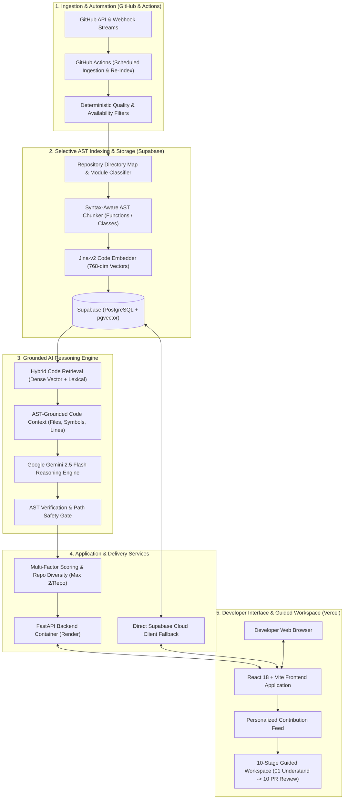
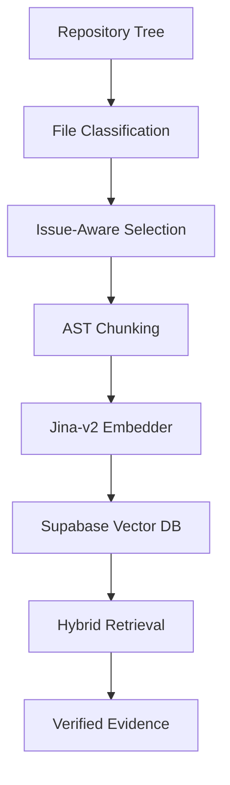
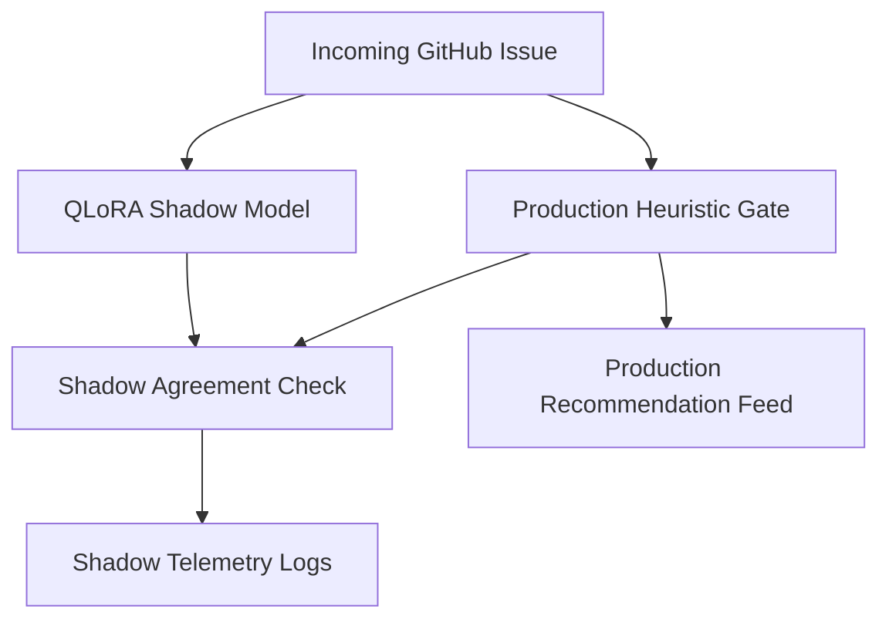

# GitNova

> **AI-Powered Open-Source Contribution Discovery, Grounded Code Intelligence, and Contribution Guidance Engine**

GitNova is a developer intelligence platform that helps software engineers discover actionable open-source contribution opportunities and guides them through the complete contribution lifecycle—from issue understanding and repository exploration to local reproduction, implementation planning, and pull request preparation.

```
Developer Preferences ──► Contribution Feed ──► Issue Understanding ──► Repository Code Context ──► Local Investigation ──► Fix Plan ──► Test Guidance ──► PR Preparation
```

---

## The Problem

Finding a suitable open-source issue on GitHub is difficult for contributors:

1. **Information Overload**: GitHub contains millions of open issues, but most "good first issue" labels are stale, already claimed, triaged as non-reproducible, or unmaintained.
2. **Context Barrier**: Navigating a large multi-package codebase requires hours of manual code exploration before a contributor can locate the bug origin or identify target functions.
3. **Hallucination & Unsupported Advice**: Naive LLM assistants often propose fictional file paths, hallucinated function signatures, or generic architectural advice disconnected from the actual repository tree.

GitNova solves this by combining automated GitHub discovery, deterministic quality gates, selective structural repository indexing, dense code retrieval (RAG), and AST-grounded LLM investigation into a guided 10-stage contributor workflow.

---

## 1. Unified End-to-End System Architecture



### Architectural Flow Explained:
1. **Ingestion & Automation**: Scheduled GitHub Actions pull candidate issues across languages and run deterministic filters to remove closed, assigned, or PR-blocked tasks.
2. **Selective AST Indexing**: Parses source code at AST function/class boundaries, generates 768-dim dense embeddings via Jina-v2, and persists them into Supabase `pgvector`.
3. **Grounded AI Reasoning**: Hybrid retrieval collects verified code snippets, enabling Gemini 2.5 Flash to synthesize root-cause plans verified against the repository tree.
4. **Application & Delivery**: FastAPI serves pre-computed data with an automated direct Supabase client fallback for standalone edge reliability.
5. **Developer Interface**: The React/Vite UI serves a diverse recommendation feed (max 2 per repo) and guides developers through an interactive 10-stage contribution workspace.

---

## 2. Selective RAG & Indexing Pipeline



### Why Selective Indexing Matters:
- **Noise Elimination**: Automatically excludes test fixtures, lockfiles, generated bindings, documentation, and minified bundles.
- **Multi-Package Coverage**: Ensures nested packages and modules receive balanced representation rather than flat-budget starvation.
- **Compute Efficiency**: Achieves **~78% compute reduction** compared to full-tree indexing while improving retrieval accuracy.

---

## 3. RAG Retrieval Performance

To evaluate retrieval behavior objectively, GitNova was benchmarked against real GitHub issues with ground-truth file targets derived from merged pull request diffs:

| Benchmark Metric | Current System Performance |
| :--- | :---: |
| **Candidate File Coverage** | **63.6%** |
| **Recall@1 (Top-1 Exact Hit)** | **27.3%** |
| **Recall@5 (Top-5 Target Hit)** | **54.5%** |
| **Mean Reciprocal Rank (MRR@10)** | **0.386** |
| **Hit Rate (Hit@10)** | **54.5%** |
| **Index Volume Reduction** | **78% compute savings vs full-tree** |

*Controlled evaluation conducted on real repository issues across Python, TypeScript, and Go.*

---

## 4. Offline ML Experiment: QLoRA Candidate-Fit Classifier

### Why We Did QLoRA Fine-Tuning in Offline Mode
Before running full-tree AST chunking, 768-dimensional dense embeddings, and LLM reasoning on an issue, we wanted to test whether a lightweight **0.5B parameter language model (`Qwen2.5-Coder-0.5B`)** could act as a **zero-cost pre-filtering gate** to predict issue actionability (`HIGH_FIT`, `MEDIUM_FIT`, `LOW_FIT`) directly from issue text and repository metadata.

We trained this model strictly in an **offline research environment** with strict repository-holdout isolation to prevent data leakage.

### Offline Experiment Results (n=90 unseen held-out issues)

| Model Architecture | Accuracy | Macro F1 | Status |
| :--- | :---: | :---: | :--- |
| **Base Qwen2.5-Coder-0.5B (Zero-Shot)** | 27.8% | 21.0% | Baseline |
| **TF-IDF + Logistic Regression** | 60.0% | 44.7% | Heuristic Baseline |
| **Fine-Tuned QLoRA Adapter (Ours)** | **82.2%** | **79.4%** | Offline Supervised Fine-Tuning |

### Confusion Matrix on Held-Out Test Set:
```
                 Predicted HIGH   Predicted MEDIUM   Predicted LOW
True HIGH             48                  2                0
True MEDIUM           10                 14                2
True LOW               0                  2               12
```

---

## 5. Shadow Evaluation & Future Roadmap

To test the model under real-world conditions without risking production stability, we deployed the QLoRA adapter in a **read-only shadow evaluation pipeline**:



### Shadow Results:
- **Live Agreement**: 12.5% (2 / 16 issues) agreement with production heuristics on live streams.
- **Latency**: ~839 ms additional inference overhead.
- **Production Gate Decision**: Because deterministic heuristic gates are faster (0 ms) and reliable, the QLoRA adapter was **safely kept offline** and not promoted to live routing.

### What We Are Planning To Do Later with the QLoRA Model:
1. **Scale the Dataset**: Expand training data from 600 issues to **5,000+ issues** labeled with verified pull request merge outcomes.
2. **Code Diff Conditioning**: Train the model on issue text combined with candidate file diffs rather than issue metadata alone.
3. **Edge Ingestion Pre-Scorer**: Deploy the fine-tuned model as an asynchronous edge worker to triage incoming GitHub webhook events before initiating heavy AST indexing pipelines.

---

## 6. The 10-Stage Contributor Journey

When a contributor opens an opportunity in GitNova, they are guided through 10 interactive stages:

| Stage | Title | Purpose |
| :---: | :--- | :--- |
| **01** | **Understand** | Synthesizes the core problem, affected scope, and expected vs. actual behavior. |
| **02** | **Check Status** | Checks active assignments, open pull requests, and PR competition status. |
| **03** | **Learn Concepts** | Teaches required domain concepts, design patterns, and library mechanisms. |
| **04** | **Explore Code** | Displays AST-verified primary fix targets, symbols, and collapsible reference context. |
| **05** | **Investigate** | Outlines local reproduction steps, failure flows, and likely error mechanisms. |
| **06** | **Plan Fix** | Delivers an AST-grounded, step-by-step technical implementation blueprint. |
| **07** | **Implement** | Highlights concrete code modifications, helper functions, and edge cases. |
| **08** | **Test Guide** | Provides exact test execution commands and blueprints for regression tests. |
| **09** | **Prepare PR** | Formats clean pull request titles, issue links, and contribution descriptions. |
| **10** | **Review Checklist** | Contributor pre-flight checklist against repository contribution standards. |

---

## 7. Technology Stack

| Component | Technology | Role |
| :--- | :--- | :--- |
| **Backend Framework** | Python 3.11, FastAPI, Pydantic v2 | High-performance asynchronous REST API & orchestration |
| **Database & Vector Store** | Supabase (PostgreSQL + `pgvector`) | Persisted issue metadata, repository maps, and 768-dim code vectors |
| **Code Embeddings** | `jinaai/jina-embeddings-v2-base-code` | Dense 768-dimensional semantic code representations |
| **AST Parsing** | Python `ast`, Tree-sitter | Syntax-aware code chunking at class and function boundaries |
| **LLM Reasoning** | Gemini 2.5 Flash / LiteLLM | Grounded root-cause reasoning and journey synthesis |
| **Frontend UI** | React 18, Vite, Tailwind CSS, Lucide | Responsive developer workspace with dark/light mode |
| **CI/CD & Automation** | GitHub Actions | Automated issue discovery rotation, re-indexing, and testing |
| **Cloud Hosting** | Vercel (Frontend), Supabase (Database & Vectors) | Global edge deployment with direct cloud database fallback |
