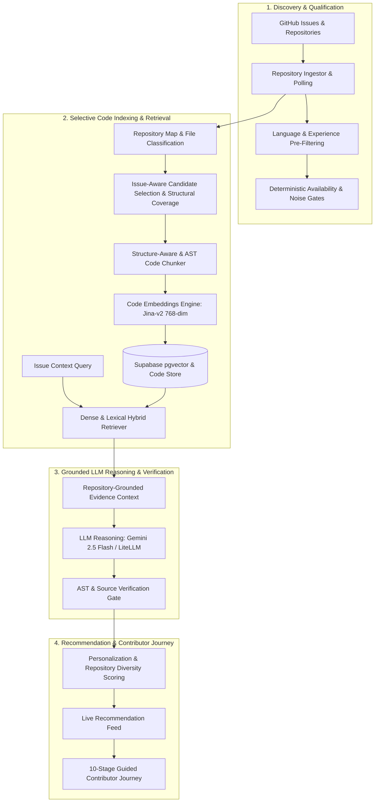
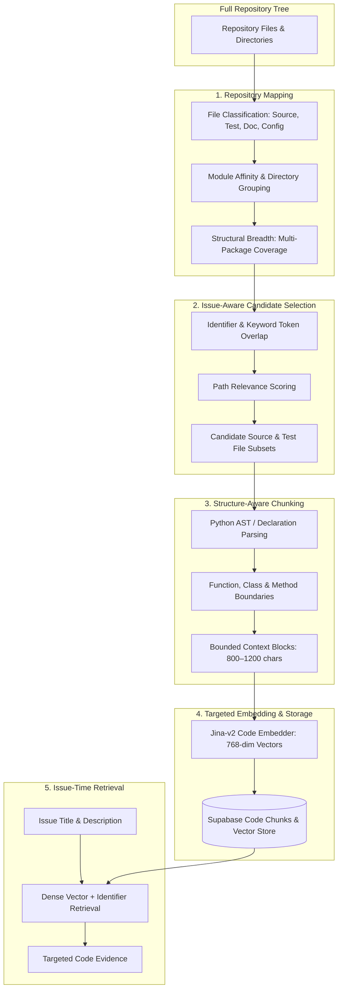
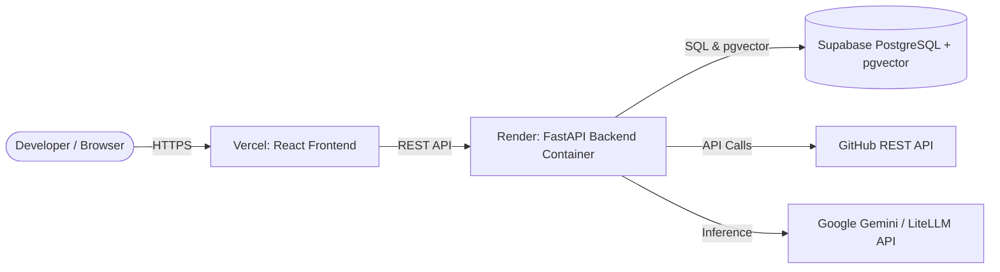

# GitNova

> **AI-Powered Open-Source Contribution Discovery and Repository-Aware Guidance Engine**

GitNova is a developer intelligence platform that helps software engineers find actionable open-source contribution opportunities and guides them through the entire contribution lifecycle—from issue selection to code exploration, local reproduction, implementation planning, and pull request preparation.

```
Developer Preferences
       ↓
Contribution Opportunities
       ↓
Issue Understanding
       ↓
Repository-Grounded Code Context
       ↓
Investigation & Reproduction
       ↓
Structured Contribution Plan
       ↓
Testing & Verification Guidance
       ↓
Pull Request Preparation
```

---

## The Problem

Finding a suitable open-source issue on GitHub is notoriously difficult for contributors:

1. **Information Overload**: GitHub hosts millions of open issues, but most "good first issue" labels are stale, already solved, triaged as non-reproducible, or unmaintained.
2. **Context Gap**: Understanding a large, unfamiliar codebase requires hours of manual exploration before a developer can even locate where a bug originates or which functions need modification.
3. **Hallucination & Generic Advice**: Naive LLM assistants often propose fictional file paths, hallucinated function signatures, or generic architectural advice disconnected from the actual repository tree.

GitNova bridges this gap by combining automated GitHub discovery, deterministic quality gates, selective structural repository indexing, dense code retrieval (RAG), and AST-grounded LLM investigation into a guided 10-stage contributor workflow.

---

## End-to-End System Architecture



---

## Selective Indexing Pipeline (RAG Architecture)

Indiscriminately chunking and embedding every file in a large multi-package repository is cost-prohibitive, introduces vector noise, and can starve critical sub-packages under a fixed token budget. 

GitNova uses a two-tier selective indexing pipeline that narrows the search space while guaranteeing module coverage before embedding:



> **Engineering Rationale**: We do not embed an entire repository indiscriminately. The system first narrows the search space using cheap metadata analysis and structural scoring, guarantees representation across distinct submodules, and then embeds only higher-value code units.

---

## Technical Deep-Dives

### 1. Structure-Aware Code Chunking
Rather than splitting repository text by fixed byte or token counts (which arbitrary breaks control flow and signatures), GitNova's chunker is syntax-aware:
- **Python AST Parsing**: Splits source code strictly at `FunctionDef`, `AsyncFunctionDef`, and `ClassDef` boundaries using Python's standard `ast` module.
- **Tree-sitter & Regex Fallbacks**: Handles non-Python languages by extracting top-level block and function declarations.
- **Markdown & Config Blocks**: Preserves header boundaries in documentation and key-value sections in configuration files (`pyproject.toml`, `setup.cfg`).
- **Bounded Sizing**: Ensures each chunk retains full symbol name, file path, line numbers (`start_line`, `end_line`), and character length constraints.

### 2. Dense Code Embeddings
- **Model**: `jinaai/jina-embeddings-v2-base-code` (pretrained transformer specialized for source code and technical vocabulary).
- **Vector Dimensions**: 768 dimensions.
- **Normalization**: Unit $L_2$ vector normalization enabled for exact cosine similarity search.
- **Hardware Acceleration**: Automatic GPU batching with automatic CPU fallback.
- **Storage**: Persisted to Supabase PostgreSQL utilizing the `pgvector` extension.

### 3. LLM Reasoning & Contributor Synthesis
- **Model Provider**: Gemini 2.5 Flash / LiteLLM with structured Pydantic schema enforcement.
- **Role**: The LLM is **not** the repository search engine. Dense retrieval localizes the actual source chunks; the LLM reasons over the retrieved evidence to synthesize:
  - Technical summary and root-cause analysis
  - Prerequisite architectural concepts
  - Step-by-step contribution plan
  - Verification & testing instructions
  - Pull request submission checklist

### 4. Repository-Grounded Verification
- Target files, line ranges, and symbols generated in contributor plans are verified directly against persisted AST nodes and repository source code.
- Grounding significantly reduces unsupported file or symbol claims and guarantees that advice presented in the UI references real repository files.

### 5. Recommendation Engine & Repository Diversity
- **Quality Gate**: Issues must satisfy strict eligibility criteria:
  - `verification_status == "VERIFIED"`
  - `quality_score >= 60` and `quality_grade != "low"`
  - `availability_status != "NOT_RECOMMENDED"` (open and unassigned)
  - Non-empty step-by-step contribution plan and verified relevant locations
- **Repository Diversity (Max 2 per Repo)**: To prevent popular repositories from monopolizing the feed, recommendations apply round-robin bucket interleaving, capping recommendations at a strict maximum of **2 issues per repository** per user query.

---

## The 10-Stage Contributor Journey

When a developer selects a contribution opportunity, GitNova guides them through 10 progressive stages:

| Stage | Title | Purpose |
| :---: | :--- | :--- |
| **01** | **Understand** | Breaks down the problem statement, affected scope, and expected vs. actual behavior. |
| **02** | **Check Status** | Validates issue availability, assignment status, and checks for existing competing pull requests. |
| **03** | **Learn Concepts** | Teaches foundational architectural and library concepts required to solve the issue. |
| **04** | **Explore Code** | Displays verified target source chunks, symbols, line ranges, and contextual reference code. |
| **05** | **Investigate** | Details reproduction steps, failure flows, and likely root-cause mechanics. |
| **06** | **Plan Fix** | Presents an AST-verified, step-by-step technical implementation plan. |
| **07** | **Implement** | Highlights concrete code modification targets, helper utilities, and edge-case handling. |
| **08** | **Test** | Provides exact test execution commands and blueprints for writing new regression unit tests. |
| **09** | **Prepare PR** | Generates a clean PR title, structured description, and links to the parent issue. |
| **10** | **Review** | Provides a final contributor pre-flight checklist against project contribution guidelines. |

---

## Technology Stack

| Layer | Technology | Purpose |
| :--- | :--- | :--- |
| **Backend Framework** | Python 3.11, FastAPI, Pydantic v2 | High-performance asynchronous REST API & pipeline orchestration |
| **Database & Vectors** | Supabase (PostgreSQL + `pgvector`) | Persisted issue metadata, repository maps, and 768-dim code embeddings |
| **Code Embeddings** | `jinaai/jina-embeddings-v2-base-code` | Dense semantic representation of code chunks and issue queries |
| **AST & Syntax Analysis** | Python `ast`, Tree-sitter | Syntax-aware code chunking at class and function boundaries |
| **LLM Reasoning** | Gemini 2.5 Flash / LiteLLM | Grounded root-cause analysis, concept generation, and fix planning |
| **Frontend Application** | React 18, Vite, Tailwind CSS, Lucide | Modern, responsive developer workspace with dark/light mode |
| **CI/CD & Automation** | GitHub Actions | Automated issue discovery rotation, re-indexing, and unit testing |
| **Hosting & Deployment** | Vercel (Frontend), Render / Docker (Backend) | Cloud production hosting with global edge delivery |

---

## System Deployment



---

## Repository Structure

```
gitnova/
├── backend/
│   ├── app/
│   │   ├── api/                   # FastAPI route definitions (/issues, /recommendations)
│   │   ├── core/                  # Configuration, logging, and security settings
│   │   ├── db/                    # Supabase database access layers and query handlers
│   │   ├── pipeline/              # Ingestion, AST chunker, embedder, and retriever
│   │   └── schemas/               # Pydantic v2 data models for issues, evidence, and plans
│   ├── scripts/                   # Evaluation CLI tools, shadow runners, and benchmarks
│   ├── tests/                     # Automated test suite (347 unit and integration tests)
│   ├── Dockerfile                 # Backend containerization for Render / cloud deployment
│   └── requirements.txt           # Python backend dependencies
├── frontend/
│   ├── src/
│   │   ├── components/
│   │   │   ├── diagrams/          # Interactive failure flow and provenance diagrams
│   │   │   ├── workspace/         # 10-stage journey views (CodeExplorerView, etc.)
│   │   │   └── ...                # Recommendation cards, filters, and navbars
│   │   ├── lib/                   # API clients, theme provider, and utility helpers
│   │   └── App.jsx                # Main application routing and state management
│   ├── package.json               # Frontend dependencies and Vite configuration
│   └── tailwind.config.js         # Design tokens, fonts, and dark mode styling
├── .github/
│   └── workflows/
│       ├── ci.yml                 # Automated test suite and build verification
│       ├── daily_pipeline.yml     # Scheduled issue discovery and qualification worker
│       └── reindex.yml            # Automated repository code re-indexing workflow
└── README.md                      # System architecture and technical documentation
```

---

## Testing & Evaluation

- **Backend Pytest Suite**: **347 passed unit and integration tests** covering API contracts, AST chunker edge cases, vector indexing, repository diversity, and LLM retry resilience.
- **Frontend Production Build**: Clean Vite production bundle compilation with zero lint or build errors.
- **Retrieval Evaluation**: Evaluates retrieval accuracy by comparing retrieved code chunks against ground-truth file diffs from known merged pull requests. This empirical feedback loop directly informed our multi-package module coverage and identifier-scoring improvements.

---

## Live Interview Demonstration Flow

1. **Preference Selection**: Select target language (e.g. *Python*) and experience level (*Beginner*).
2. **Recommendation Feed**: View diverse, qualified contribution opportunities with real-time availability badges and repository diversity (max 2 per repo).
3. **Select Opportunity**: Open `psf/requests#7564` (*raise FileNotFoundError for missing TLS material*).
4. **Walk Through Stages**:
   - **Stage 01 (Understand)**: Review the problem summary and expected behavior.
   - **Stage 03 (Learn Concepts)**: Examine grounded prerequisite concepts (*TLS Verification, File Path Checks*).
   - **Stage 04 (Explore Code)**: Inspect the AST-verified primary fix target in `src/requests/adapters.py` (`_urllib3_request_context`, lines 85–119) and collapsible reference context.
   - **Stage 05–08 (Investigate, Plan, Test)**: Review the reproduction steps, 4-step implementation plan, and `pytest tests/test_requests.py` verification instructions.
5. **Codebase & Architecture**: Return to the repository to explain the underlying RAG, chunking, and grounding architecture using this README.

---

## Core Engineering Principles

1. **Retrieve Before Generating**: Feed real, retrieved repository context into the LLM rather than asking it to invent file paths or code locations.
2. **Selective Indexing over Indiscriminate Embedding**: Narrow the file space using structural scoring and module coverage before embedding to minimize noise and compute cost.
3. **Structure-Aware Units**: Parse code at AST and declaration boundaries rather than slicing arbitrary token chunks.
4. **Generic Logic over Demo Specialization**: Enforce generic database schemas, generic SQL queries, and universal diversity rules across all supported ecosystems.
5. **Quality & Availability Gates**: Actively verify issue state and PR competition before recommending issues to contributors.
