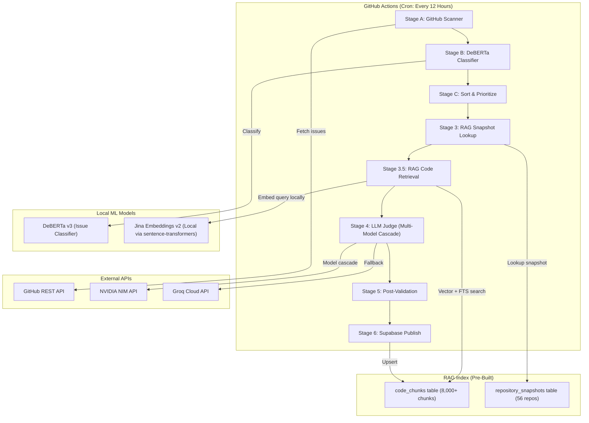
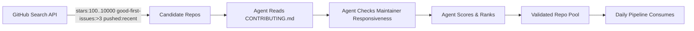

# GitNova — Complete Architecture, Strategy & AI Planning Document

> **Purpose:** This document is the single source of truth for GitNova's current architecture, proposed evolution, and strategic roadmap. It ends with a reusable prompt you can give to any AI (Claude, ChatGPT, Gemini) to continue planning and building.

---

## Table of Contents
1. [Project Vision & Goal](#1-project-vision--goal)
2. [Current Architecture (V3 — What's Built)](#2-current-architecture-v3--whats-built)
3. [Honest Assessment — What Works & What Doesn't](#3-honest-assessment--what-works--what-doesnt)
4. [Proposed Evolution — The V4 Blueprint](#4-proposed-evolution--the-v4-blueprint)
5. [Competitive Landscape — Where GitNova Stands](#5-competitive-landscape--where-gitnova-stands)
6. [LinkedIn Positioning Strategy](#6-linkedin-positioning-strategy)
7. [Master AI Prompt — For Any AI To Continue](#7-master-ai-prompt--for-any-ai-to-continue)

---

## 1. Project Vision & Goal

**GitNova** is an AI-powered open-source contribution mentor. It doesn't just find GitHub issues — it reads the actual source code of repositories, matches issues to relevant code, and generates tactical fix blueprints that tell beginners exactly which file, function, and line to change.

### Creator's Goal
- Build a **portfolio-grade ML engineering project** demonstrating RAG, multi-model LLM orchestration, and production ML pipelines.
- Present confidently on **LinkedIn** to attract recruiter and engineering attention.
- Genuinely help **beginners, GSoC aspirants, and students** make their first open-source contributions.

---

## 2. Current Architecture (V3 — What's Built)

### 2.1 System Overview Diagram



### 2.2 Pipeline Flow (Step-by-Step)

| Stage | What Happens | Tech Used |
|-------|-------------|-----------|
| **A. GitHub Scan** | Fetches 15 newest open, unassigned issues per repo across 65 repos (6 categories) | GitHub REST API |
| **B. DeBERTa Filter** | Local transformer classifies each issue as Bug/Feature/Question. Filters out noise below 0.30 confidence | `microsoft/deberta-v3-base` fine-tuned |
| **C. Prioritize** | Sorts candidates by DeBERTa confidence. Takes top 10 per category | Python sorting |
| **3. RAG Lookup** | Checks Supabase for an ACTIVE `repository_snapshot` for each repo. Gets the `commit_sha` | Supabase REST |
| **3.5. Code Retrieval** | Embeds the issue text locally, queries `match_chunks_vector` + `match_chunks_lexical` RPCs, fuses via RRF | sentence-transformers (local), Supabase pgvector |
| **4. LLM Judge** | Sends issue text + retrieved code chunks to a 4-model cascade. Gets a structured JSON tactical fix plan | NVIDIA (Gemma 4 31B, Llama 3.3 70B) → Groq (Qwen 3.6 27B, Llama 4 Scout 17B) |
| **5. Validation** | Checks the LLM output for banned generic verbs, missing file paths, and hallucinated extensions. Retries once if invalid | Python rule engine |
| **6. Publish** | Scores the hint (0-100), assigns quality grade (High/Medium), upserts to Supabase `issues` table | Supabase REST |

### 2.3 Database Schema (Supabase / PostgreSQL)

#### `repository_snapshots`
| Column | Type | Purpose |
|--------|------|---------|
| `id` | UUID (PK) | Unique snapshot ID |
| `repo_name` | text | e.g., `facebook/react` |
| `commit_sha` | text | Git commit the index was built from |
| `status` | text | `STAGING`, `ACTIVE`, `FAILED`, `RETIRED` |
| `chunk_count` | int | Number of code chunks indexed |
| `embedding_model` | text | `jinaai/jina-embeddings-v2-base-code` |

#### `code_chunks`
| Column | Type | Purpose |
|--------|------|---------|
| `chunk_id` | text (PK) | SHA256 hash of content + position |
| `snapshot_id` | UUID (FK) | Links to `repository_snapshots` |
| `repo_name` | text | Repository name |
| `commit_sha` | text | Commit this chunk was extracted from |
| `file_path` | text | e.g., `src/reconciler/ReactFiber.js` |
| `symbol_name` | text | Function/class name |
| `content` | text | Actual source code text |
| `embedding` | vector(768) | Jina embedding vector |
| `fts` | tsvector | Full-text search index |

#### `issues` (Published Recommendations)
| Column | Type | Purpose |
|--------|------|---------|
| `id` | UUID (PK) | Unique issue ID |
| `repo_name` | text | Source repository |
| `title` | text | Issue title |
| `ai_hint` | text | AI-generated tactical fix plan |
| `quality_score` | int | 0-100 quality rating |
| `quality_grade` | text | `High`, `Medium`, `Low` |
| `model_provider` | text | `nvidia` or `groq` |
| `retrieval_method` | text | `RRF` (with RAG) or `NONE` (LLM only) |
| `category` | text | `Frontend`, `Backend`, `ML`, etc. |
| `status` | text | `PUBLISHED`, `CLOSED`, `ASSIGNED` |

### 2.4 Key Files in the Codebase

| File | Purpose |
|------|---------|
| `backend/app/main.py` | Pipeline orchestrator — runs all stages |
| `backend/app/pipeline/bot.py` | LLM Judge — prompt engineering, 4-model cascade |
| `backend/app/pipeline/code_retriever.py` | RAG retrieval — vector + lexical search + RRF fusion |
| `backend/app/pipeline/code_indexer.py` | Code chunking, embedding, and Supabase storage |
| `backend/app/pipeline/embedder.py` | Local sentence-transformers embedding module |
| `backend/app/pipeline/github_client.py` | GitHub API wrapper (issues, repos, timelines) |
| `backend/app/ml/transformer_brain.py` | DeBERTa inference wrapper |
| `backend/scripts/reindex_repos.py` | One-time full repo indexing script |
| `.github/workflows/daily_pipeline.yml` | GitHub Actions cron (every 12 hours) |
| `.github/workflows/reindex.yml` | Manual trigger for re-indexing |

### 2.5 ML Models Used

| Model | Purpose | Where It Runs | Cost |
|-------|---------|---------------|------|
| `microsoft/deberta-v3-base` | Issue classification (Bug/Feature/Question) | GitHub Actions CPU | Free |
| `jinaai/jina-embeddings-v2-base-code` | Code embedding (768-dim vectors) | GitHub Actions CPU (local via sentence-transformers) | Free |
| `google/gemma-4-31b-it` | Primary LLM Judge | NVIDIA NIM API (free tier) | Free |
| `meta/llama-3.3-70b-instruct` | Fallback LLM Judge | NVIDIA NIM API (free tier) | Free |
| `qwen/qwen3.6-27b` | Second fallback | Groq Cloud (free tier) | Free |
| `meta/llama-4-scout-17b-16e-instruct` | Last resort fallback | Groq Cloud (free tier) | Free |

### 2.6 GitHub Actions Workflow

```yaml
# Runs every 12 hours
schedule:
  - cron: '30 6,18 * * *'   # 6:30 AM and 6:30 PM UTC

# Timeout: 3 hours
timeout-minutes: 180

# Secrets used:
# GITHUB_TOKEN, SUPABASE_URL, SUPABASE_KEY,
# NVIDIA_API_KEY, GROQ_API_KEY
```

---

## 3. Honest Assessment — What Works & What Doesn't

### ✅ What Works Well
- **RAG Pipeline:** Vector + lexical hybrid search with RRF fusion is production-grade.
- **Multi-Model Cascade:** 4-model fallback ensures high availability even when individual APIs are down.
- **Post-Validation:** Catches generic LLM outputs (banned verbs, hallucinated paths) and retries — not just blind trust.
- **DeBERTa Pre-Filter:** Removes 60% of noise (questions, feature requests) before hitting expensive LLM calls.
- **Zero-Cost Stack:** Every ML model runs for free (local CPU or free API tiers).

### ❌ What Doesn't Work / Needs Fixing
| Problem | Root Cause | Impact |
|---------|-----------|--------|
| **Only 6% RAG coverage** | Jina API balance ran out silently. Fixed by switching to local embeddings, but hasn't been re-tested in production yet | Most hints were LLM-only guesses, not code-grounded |
| **No beginner tiering** | All 65 repos are tier-1 monoliths. A beginner sees `kubernetes/kubernetes` next to `pallets/flask` | Beginners get intimidated and bounce |
| **Static repo list** | `ALL_REPOS` is hardcoded in `main.py`. No dynamic discovery | System can't adapt to new repos or GSoC orgs |
| **No competition scoring** | Pipeline doesn't check comment count, reaction count, or assignee race conditions | Recommended issues may already be congested |
| **No Git guidance** | Hints tell you WHAT to fix but not HOW to fork/branch/PR | Beginners who don't know Git still can't contribute |
| **No outcome tracking** | `track_pr_outcomes.py` exists but was never deployed | Can't prove that GitNova recommendations lead to actual merged PRs |

---

## 4. Proposed Evolution — The V4 Blueprint

### 4.1 Three-Tier Repository & Issue Classification

```
┌─────────────────────────────────────────────────────────────────────┐
│                     GITNOVA PROGRESSION PATH                        │
├─────────────────────────────────────────────────────────────────────┤
│ 🟢 TIER 1: STARTER (First PR in 24 Hours)                          │
│    • Repos under 10K LOC, simple build (pip/npm install)            │
│    • Issues: good-first-issue labels, 0-2 comments, unassigned      │
│    • Examples: markupsafe, cors, nanoGPT, httpbin                   │
│    • RAG: Index ENTIRE codebase (only 20-50 files)                  │
├─────────────────────────────────────────────────────────────────────┤
│ 🟡 TIER 2: GSOC & MID-TIER (Portfolio Builder)                      │
│    • GSoC orgs and mid-sized projects (10K-100K LOC)                │
│    • Active maintainers, structured contribution guides             │
│    • Examples: sympy, zulip, Rocket.Chat, streamlit, processing4    │
│    • RAG: Index top 50 core files                                   │
├─────────────────────────────────────────────────────────────────────┤
│ 🔴 TIER 3: ECOSYSTEM CORE (Senior-Level Showcase)                   │
│    • Major frameworks: React, PyTorch, Kubernetes, Next.js          │
│    • Deep domain expertise required, high competition               │
│    • RAG: Index top 50 files (directional, not exact)               │
└─────────────────────────────────────────────────────────────────────┘
```

### 4.2 Agentic Repository Discovery

**Current (Static):** Hardcoded list of 65 repos in `main.py`.

**Proposed (Dynamic Agent):**



**Discovery Criteria:**
- Stars: 100–10,000 (popular enough to matter, small enough for beginners)
- `good-first-issues:>3` (maintainer actively labels issues for newcomers)
- Pushed within last 30 days (actively maintained)
- Has `CONTRIBUTING.md` (welcomes outside contributors)
- Average PR merge time < 7 days (responsive maintainers)

**This makes GitNova self-evolving.** No manual curation. The agent discovers, validates, and adds repos automatically.

### 4.3 Competition Scoring Engine

For every issue, compute a **Competition Score** before recommending it:

```
competition_score = 1 / (1 + comments + reactions + (1 if assignee else 0))
freshness_bonus = max(0, 1 - (days_since_created / 30))
accessibility = competition_score * freshness_bonus
```

- **High accessibility (>0.7):** Perfect for beginners — fresh, no takers
- **Medium (0.3–0.7):** Some discussion but still open — good for mid-tier
- **Low (<0.3):** Congested — only recommend to advanced users

### 4.4 Contextual Git Guidance in Hints

Instead of building a separate Git tutorial, append Git instructions to every AI hint:

```markdown
## How to Contribute
1. Fork `pallets/markupsafe` → Click "Fork" on GitHub
2. Clone: `git clone https://github.com/YOUR_USERNAME/markupsafe.git`
3. Branch: `git checkout -b fix/issue-247`
4. Make the changes described above
5. Commit: `git commit -m "fix: resolve HTML escaping edge case (#247)"`
6. Push: `git push origin fix/issue-247`
7. Open a Pull Request on GitHub referencing Issue #247
```

This is generated by adding a paragraph to the LLM system prompt. Zero infrastructure cost.

### 4.5 Outcome Tracking & Portfolio Metrics

Track whether GitNova's recommendations lead to real merged PRs:

1. **Daily Check:** For each published issue, query GitHub Timeline API for `cross-referenced` or `connected` events linking to a merged PR.
2. **Store Results:** `hint_correct` boolean + `linked_pr_url` in the `issues` table.
3. **Portfolio Metric:** *"GitNova's recommendations led to X merged PRs across Y repositories"* — the single most impressive number for LinkedIn.

### 4.6 Enhanced AI Hint Format

**Current format:**
```
Goal → Files → Change
```

**Proposed format (for beginners):**
```
🎯 Goal: [What this fix accomplishes]
📁 Files: [Exact file paths from RAG]
🔧 Change: [Step-by-step code change instructions]
⏱️ Estimated Time: 15-30 minutes
🏷️ Competition: Low (0 comments, unassigned)
🚀 How to Contribute: [Fork → Branch → Commit → PR instructions]
```

---

## 5. Competitive Landscape — Where GitNova Stands

| Platform | Issue Discovery | AI Hints | Code Grounding (RAG) | Git Guidance | Repo Discovery |
|----------|:-:|:-:|:-:|:-:|:-:|
| **goodfirstissue.dev** | ✅ Static list | ❌ | ❌ | ❌ | ❌ |
| **up-for-grabs.net** | ✅ Static list | ❌ | ❌ | ❌ | ❌ |
| **CodeTriage** | ✅ Email digest | ❌ | ❌ | ❌ | ❌ |
| **First Timers Only** | ✅ Curated | ❌ | ❌ | ❌ | ❌ |
| **GitHub Explore** | ✅ Trending | ❌ | ❌ | ❌ | ❌ |
| **GitNova V3 (Current)** | ✅ Automated | ✅ LLM Judge | ✅ RAG + RRF | ❌ | ❌ |
| **GitNova V4 (Proposed)** | ✅ Automated | ✅ LLM Judge | ✅ RAG + RRF | ✅ Contextual | ✅ Agentic |

**GitNova's moat:** No other platform reads the actual source code and generates file-and-function-level fix blueprints. Every competitor just shows you the issue title and says "good luck."

---

## 6. LinkedIn Positioning Strategy

### ❌ Don't Say:
> "I built a tool that helps beginners find open-source issues"

### ✅ Do Say:
> "I built an AI system that indexes 8,000+ source code files across 60+ open-source repositories, uses RAG (Retrieval-Augmented Generation) with hybrid vector + lexical search, and generates exact file-and-function-level fix blueprints — transforming 'I don't know where to start' into 'open this file, change this function, submit this PR.'"

### Key Technical Talking Points:
1. **RAG Pipeline:** pgvector + FTS hybrid search with Reciprocal Rank Fusion
2. **Multi-Model LLM Cascade:** 4-model fallback across NVIDIA NIM + Groq
3. **DeBERTa Pre-Filter:** Fine-tuned transformer that removes 60% of noise before LLM
4. **Post-Validation Engine:** Rule-based checker that catches LLM hallucinations and retries
5. **Zero-Cost Architecture:** Entire stack runs on free tiers (GitHub Actions + Supabase + NVIDIA + Groq + local embeddings)
6. **Production CI/CD:** Automated 12-hour cron pipeline with graceful fallbacks

---

## 7. Master AI Prompt — For Any AI To Continue

> Copy everything below and paste into any AI (Claude, ChatGPT, Gemini) to continue planning and building GitNova.

---

```markdown
# Context: GitNova — AI-Powered Open-Source Contribution Mentor

You are the Lead Systems Architect and Chief Product Officer for GitNova, an AI-powered platform that guides developers into open-source contributions.

## What GitNova Currently Does (V3 — Production):
1. Scans 65 GitHub repos every 12 hours via GitHub Actions cron.
2. Filters issues using a fine-tuned DeBERTa v3 classifier (removes noise: questions, feature requests).
3. Retrieves relevant source code from an indexed database (8,000+ code chunks stored in Supabase with pgvector).
4. Uses RAG (hybrid vector + FTS search with RRF fusion) to ground the LLM in actual source code.
5. Sends issue text + retrieved code to a 4-model LLM cascade (NVIDIA Gemma 4 → Llama 3.3 → Groq Qwen 3.6 → Llama 4 Scout).
6. The LLM generates a structured JSON tactical fix plan with exact file paths, function names, and step-by-step changes.
7. A post-validation engine checks for generic verbs, hallucinated paths, and missing specifics. Retries once if invalid.
8. Valid issues are published to Supabase with quality scores (0-100).

## Tech Stack:
- **Backend:** Python, GitHub Actions (CI/CD), Supabase (PostgreSQL + pgvector)
- **ML Models:** DeBERTa v3 (classifier), Jina Embeddings v2 (local via sentence-transformers), Gemma 4 / Llama 3.3 / Qwen 3.6 / Llama 4 Scout (LLM judges)
- **RAG:** Hybrid vector similarity (cosine) + full-text search (GIN index), fused via Reciprocal Rank Fusion (RRF)
- **Cost:** 100% free tier (GitHub Actions + Supabase free + NVIDIA NIM free + Groq free + local embeddings)

## Known Problems to Solve:
1. **No Beginner Tiering:** All 65 repos are major frameworks. Beginners get intimidated. Need a 3-tier system: Starter (small repos, zero friction) → GSoC/Mid-Tier → Advanced Core.
2. **Static Repo List:** `ALL_REPOS` is hardcoded. Need agentic discovery — an LLM agent that autonomously finds beginner-friendly repos via GitHub Search API, reads their CONTRIBUTING.md, checks maintainer responsiveness, and adds validated repos to the pool.
3. **No Competition Scoring:** Pipeline doesn't check comment count or assignee race conditions. Need an accessibility score per issue.
4. **No Git Guidance:** Hints tell you WHAT to fix but not HOW to fork/branch/PR. Need contextual Git instructions appended to every hint.
5. **No Outcome Tracking:** Need to track whether recommended issues lead to merged PRs (via GitHub Timeline API).
6. **RAG Coverage:** Recently fixed Jina API dependency by switching to local embeddings. Need to verify all 56 indexed repos now get proper RAG retrieval.

## Creator's Goal:
- Build a **portfolio-grade ML engineering project** for LinkedIn.
- Demonstrate: RAG pipelines, multi-model LLM orchestration, production ML ops, prompt engineering, and agentic AI.
- Genuinely help beginners make their first open-source contributions.

## Your Task:
Based on the above context, help me plan and execute the next phase of GitNova. Be specific, technical, and production-oriented. Consider scalability, cost (must stay free), user experience for beginners, and portfolio presentation value. Challenge my assumptions if they're wrong. Suggest concrete implementations, not generic advice.
```
