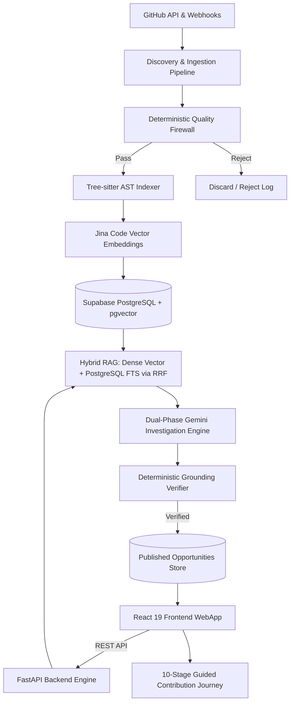

# GitNova — Production System Architecture & Runtime Trace

This document maps the exact production execution path of GitNova from automated GitHub ingestion through the FastAPI backend to the React 19 frontend.

---

## 1. End-to-End Production Data Flow

---

## 2. Production Subsystem Mapping

### A. Backend Architecture (`backend/app/`)
1. **Entrypoint & Server Startup**:
   - Primary Entrypoint: [`backend/app/main.py`](file:///c:/gitNova/backend/app/main.py)
   - Application Factory: Creates FastAPI instance, configures CORS middleware, loads `.env`, registers API routes.
2. **API Routes (`backend/app/api/`)**:
   - `issues.py`: Endpoints for fetching published issues, filtering by difficulty/language/tags, and single issue dossiers.
   - `search.py`: Hybrid search over indexed code and issues.
   - `health.py`: Liveness and readiness health checks.
3. **Core Intelligence Pipeline (`backend/app/pipeline/`)**:
   - `discovery.py`: Ingestion controller monitoring open-source repositories.
   - `filter.py`: 10-gate deterministic firewall (rejects PRs, bot issues, security CVEs).
   - `indexer.py`: Tree-sitter AST parser extracting syntax nodes (functions, classes, methods).
   - `retrieval.py`: Hybrid RAG fusing dense Jina 768-dim embeddings with PostgreSQL FTS using Reciprocal Rank Fusion (RRF k=60).
   - `llm_investigator.py`: Phase 1 & 2 structured Gemini reasoning.
   - `grounding_verifier.py`: Programmatic verification checking cited file paths and symbols against AST nodes.
   - `journey_generator.py`: Formats 10-stage structured contribution journeys.
4. **Database & Storage Layer (`backend/app/db/`)**:
   - `client.py`: Supabase PostgreSQL client connection.
   - Tables: `issues`, `repos`, `code_chunks`, `repository_snapshots`, `eval_results`.

---

### B. Frontend Architecture (`frontend/src/`)
1. **Entrypoint & Routing**:
   - Entrypoint: [`frontend/src/main.tsx`](file:///c:/gitNova/frontend/src/main.tsx)
   - App Root: [`frontend/src/App.tsx`](file:///c:/gitNova/frontend/src/App.tsx)
   - Router: Client-side routing across Issue Feed, Issue Detail Workspace, and Preference Filters.
2. **Components (`frontend/src/components/`)**:
   - `IssueFeed`: Interactive card grid with difficulty badges, suitability scores, and verified checkmarks.
   - `IssueDetail`: Comprehensive 10-stage guided walkthrough modal/page.
   - `PreferenceBar`: Multi-criteria filter (language, beginner tier, repository scope).
3. **API Integration (`frontend/src/services/api.ts`)**:
   - Axios REST client communicating with FastAPI backend.

---

### C. Deployment & Infrastructure
- **Frontend Hosting**: Vercel (`vercel.json`) building with `npm run build` (Vite).
- **Backend Hosting**: Containerized Render / Cloud Run (`Dockerfile`, `render.yaml`).
- **Database**: Supabase PostgreSQL with `pgvector` extension enabled.
- **GitHub Actions Automation (`.github/workflows/`)**:
  - `ci.yml`: Automated backend pytest and frontend lint/type checks on push/PR.
  - `ingestion.yml`: Scheduled cron job running repository discovery and pipeline ingestion.
"""

with open(docs_maint / "production_architecture.md", "w", encoding="utf-8") as f:
    f.write(CodeContent)
